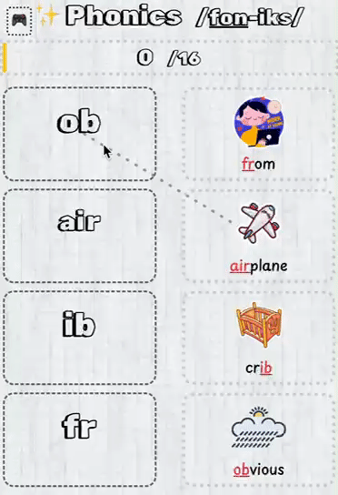

# Phonics

This project is dedicated to helping you master English pronunciation through the study of phonics.

Visit our website at https://phonics.misuisui.com/ for more information and to use our interactive learning tools.

## Demo

## What is Phonics?

Phonics is a method employed to teach reading and writing in the English language. Young children are taught the English phonics rules, so they can begin to decode words based on their sounds.

## Why Phonics?

As a parent teaching English to my kids, I found a lot of phonics resources in print and video. However, I noticed the lack of a simple, straightforward website that allowed me to quickly find out how to pronounce a certain combination of letters. This inspired me to create this project for learning Phonics.

## Learn Through Play

Our project offers a fun and engaging matching game. This game is designed to reinforce the phonics rules and pronunciation learned through the interactive sessions.

### How to Play

The game presents you with a set of cards, each representing a different phonics sound. Your task is to match each sound with its corresponding phonics rule. This not only helps to reinforce what you've learned but also makes the learning process more enjoyable and engaging.

Remember, learning English pronunciation can be fun too!

## How to Start the Project

In this project, we use `npm scripts` to manage common development tasks. Here are some commands you might need:

- `npm run dev`: Starts the development server with hot reloading.
- `npm run build`: Builds the application for production.
- `npm run start`: Starts the application in production mode.
- `npm run lint`: Runs ESLint to check for issues in the code.

Before running these commands, make sure you have installed all dependencies. You can install them by running `npm install`.
